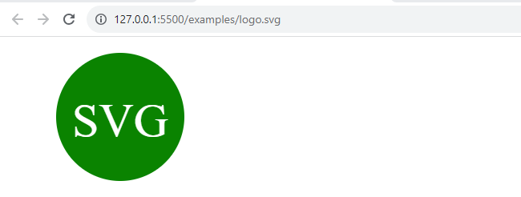

# Devins Logo Maker

## Description

The motivation behind this project was to become familiar with Object Orientated Programming and how to use it in very simple ways. This exercise helped us understand how to write prompts/questions in our JS without ever having to open an html file. using the Inquirer package and Writefile codes to expand our knowledge and continue learning more about the backend side of Javascript.

## Table of Contents (Optional)

If your README is long, add a table of contents to make it easy for users to find what they need.

- [Installation](#installation)
- [Usage](#usage)
- [Credits](#credits)
- [License](#license)

## Installation

To install my Project, all you have to do is create a JS File in your code editor. once there, you can create prompts to allow for users input then use the createfile code or other option to then generate a logo to their clients or their own needs.

## Usage

You will create these prompts in your javascript file, once done, you will open within the integrated terminal so that you have the most up to date file and information. Here, you will run the node command (node index.js) this will then prompt for the users input regarding the color, text and shape of the logo they are making. VSC will take all the responses that the user put in and populate a .svg file with that information

## Credits

TA, Office Hours, Teacher

## License

License: MIT

Link to video demo: https://github.com/Devinmarshill/SVG-Logo/blob/main/Demonstration%20Video.webm
